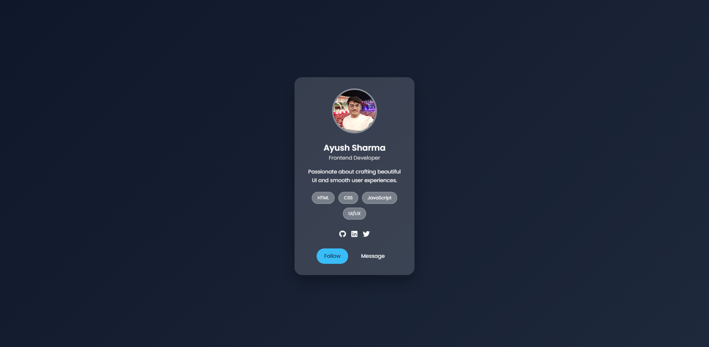

# 🌟 Profile Card UI

A modern, visually appealing **Profile Card UI** built using **HTML & CSS only**.  
This project showcases a glassmorphism-style card suitable for portfolios, personal websites, or social profile previews.

---

## 🚀 Features

- Modern **glassmorphism UI**
- Clean **dark theme background**
- Circular profile image
- Name, role & short bio
- Skill tags (HTML, CSS, JavaScript, UI/UX)
- Social media icons (GitHub, LinkedIn, Twitter)
- Interactive buttons (Follow & Message)
- Smooth hover animations
- Fully responsive & centered layout

---

## 🛠️ Built With

- **HTML5**
- **CSS3**
- **Google Fonts (Poppins)**
- **Font Awesome Icons**

---

## 📂 Project Structure

profile-card/
│
├── index.html
├── style.css
├── assests/
│   ├── profile.jpg
│   └── preview.png
└── README.md


---

## 📸 Preview

> A sleek profile card with a glass effect placed on a dark gradient background, suitable for developer portfolios or UI showcases.



---

## 🧑‍💻 Author

**Ayush Sharma**  
Frontend Developer  

- GitHub: [your-github-link]
- LinkedIn: [your-linkedin-link]
- Twitter: [your-twitter-link]

---

## 📌 How to Use

1. Clone the repository:
   ```bash
   git clone https://github.com/your-username/profile-card-ui.git
